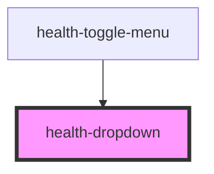

# health-dropdown

<!-- Auto Generated Below -->

## Properties

| Property      | Attribute | Description | Type                  | Default             |
| ------------- | --------- | ----------- | --------------------- | ------------------- |
| `alignConfig` | --        |             | `DropdownAlignConfig` | `INIT_ALIGN_CONFIG` |
| `container`   | --        |             | `HTMLElement`         | `null`              |
| `open`        | `open`    |             | `boolean`             | `false`             |

## Dependencies

### Used by

 - [health-toggle-menu](..\health-toggle-menu)

### Graph

----------------------------------------------

*Built with [StencilJS](https://stenciljs.com/)*
